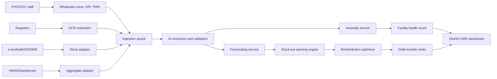

# PulseGrid Project Write-Up

## Problem

Primary Health Centres and Community Health Centres are expected to provide reliable local care, but district administrators often discover operational failures too late. Medicine stock-outs, high footfall, bed unavailability, doctor service gaps and test downtime are usually tracked in registers or siloed government systems. The result is delayed action, emergency procurement and avoidable patient referrals.

## Proposed Solution

PulseGrid is a multilingual AI platform for real-time health-centre management. It builds a live district operations twin across PHCs and CHCs by passively capturing five operational streams:

1. Stock.
2. Patient footfall.
3. Beds.
4. Doctor attendance/service continuity.
5. Test availability.

It then generates:

- Early stock-out warnings.
- Demand forecasts.
- Smart redistribution recommendations.
- Under-resourced centre flags for district intervention.

## Why This Is Practical

The design starts from the real adoption constraint: PHC staff will not do new data entry. PulseGrid uses zero-friction capture:

- WhatsApp voice notes in Hindi and regional languages.
- Photos of existing stock, OPD, bed and lab registers.
- IVR calls for 2G/low-connectivity areas.
- e-Aushadhi/DVDMS imports for stock and issue history.
- HMIS reconciliation for official aggregate service reporting.
- eSanjeevani counts as a service-continuity signal.

## Architecture



## Google Cloud Deployment Path

The hackathon prototype is static and deployed to GitHub Pages through GitHub Actions. A real district pilot would use:

- Cloud Run for Spring Boot/FastAPI services.
- Pub/Sub for ingestion from WhatsApp/IVR/OCR adapters.
- Cloud SQL with PostGIS for facility, stock and route data.
- Cloud Storage for temporary register images with lifecycle deletion.
- Vertex AI or Document AI for OCR/extraction workflows where budget permits.
- Cloud Scheduler for nightly forecasts and escalation checks.
- BigQuery/Looker for district and state monitoring.

## Data And Models

### Medicine Demand

Use LightGBM/CatBoost quantile models where history exists. Use seasonal baselines for sparse PHCs and Croston/TSB methods for intermittent items.

### Footfall

Use seasonal baselines plus gradient boosting features: day of week, rainfall, local outbreak indicators, market days, festivals, school calendars and seasonal disease cycles.

### Beds

Use simple occupancy and queue models using arrivals, average length of stay, referral pressure and delivery load. This is more explainable than a black-box model.

### Doctor Attendance

Avoid surveillance. Infer service continuity from OPD patterns, prescription cadence, eSanjeevani sessions and register activity. Suspicious gaps go to the MO/CMO for verification.

### Test Availability

Forecast tests from syndrome footfall. Fever drives malaria/dengue/RDT demand. ANC drives Hb, pregnancy and urine test demand.

## Redistribution Optimization

The district is modeled as a graph:

- Nodes: PHCs, CHCs and district warehouse.
- Edges: distance, time, transport cost and cold-chain capability.
- Lots: item, quantity, batch, expiry and storage requirement.

Objective:

```text
minimize stockout_penalty
       + transport_cost
       + expiry_waste
       + cold_chain_violation_penalty
       + equity_penalty
```

Constraints:

- Sender cannot fall below buffer stock.
- Receiver cannot exceed storage capacity.
- FEFO batch movement is preferred.
- Cold-chain items move only on valid routes.
- CHCs retain emergency reserve.
- Human approval is required before dispatch.

## Privacy And Compliance

PulseGrid does not need patient-level records for this use case.

- No ABHA ID is required.
- No patient names are stored.
- Register photos are processed for aggregate counts and then deleted.
- Role-based access is used for PHC, block and district users.
- The design aligns with the DPDP Act 2023 by minimizing personal data collection.
- ABDM alignment is through facility metadata and health facility identifiers, not patient records.

## 48-Hour Build Scope

Built:

- Static command-centre prototype.
- Hindi/Marathi voice-note simulation.
- Stock-out queue.
- Redistribution order simulation.
- Facility score.
- CMO copilot response.
- GitHub Actions CI/CD to GitHub Pages.

Mocked:

- Live WhatsApp Business integration.
- Live e-Aushadhi/HMIS APIs.
- Real OCR service.
- Real procurement order dispatch.

## Sustainability Path

1. Run an NHM district pilot with 30-50 facilities.
2. Use e-Aushadhi/DVDMS exports and HMIS reports as official reconciliation sources.
3. Measure reduction in stock-out days, emergency indents, transfer-order turnaround and test downtime.
4. Expand to state health department procurement as a decision-support layer over existing systems.
